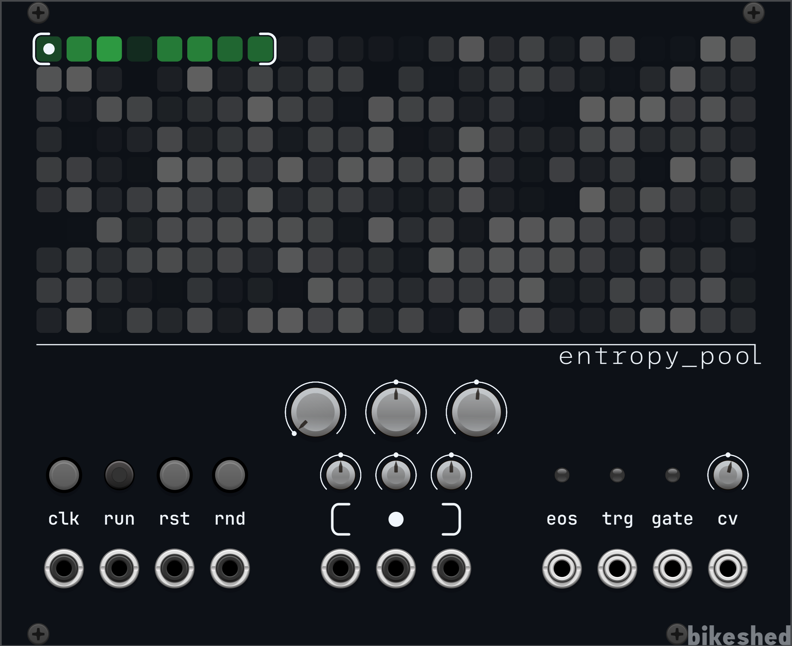
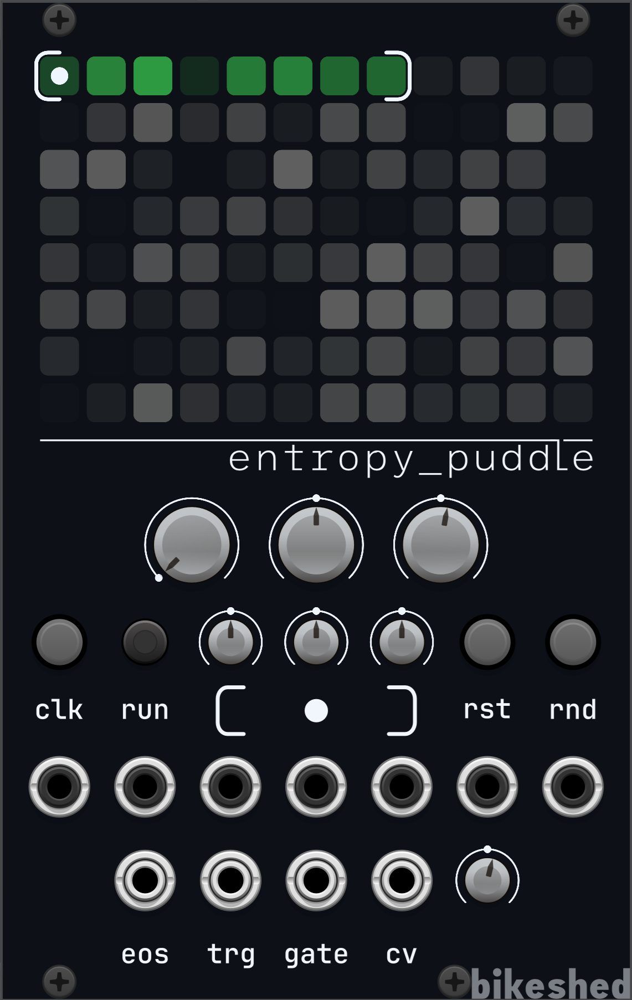

# Bikeshed VCV Rack plugin

## [Entropy Pool](./doc/EntropyPool.md) - Indexable randomness

## [Entropy Puddle](./doc/EntropyPuddle.md) - A bit less indexable randomness

# Development

## Local compilation

1. Download the [Rack SDK](https://vcvrack.com/downloads/) for your platform
2. Set the `RACK_DIR` environment variable to its path
3. `make && make install`

## Cross-platform compilation with Docker

1. `docker compose run --rm build`
    * Generates plugins in `./plugin-build`

# License and Copyright

This software is licensed under the Gnu General Public License v3 or later. The license is included
in the file "LICENSE" in this repository.

It is a derived work of VCVRack (which is GPL3 or later) and its dependencies.

It contains the [JetBrains Mono](https://www.jetbrains.com/lp/mono) font and a modified
[League Mono](https://github.com/theleagueof/league-mono) font, both of which are licensed under
the [SIL Open Font License 1.1](https://openfontlicense.org/open-font-license-official-text).

The SVGs used (in res) are distributed under the Creative Commons CC-BY-NC-SA-4.0 and are copyright
the authors with authorship indicated by the GitHub transaction log.

Copyright to this software is held by the authors with authorship indicated by the GitHub
transaction log.

## TODO

* Manual
* Publish
